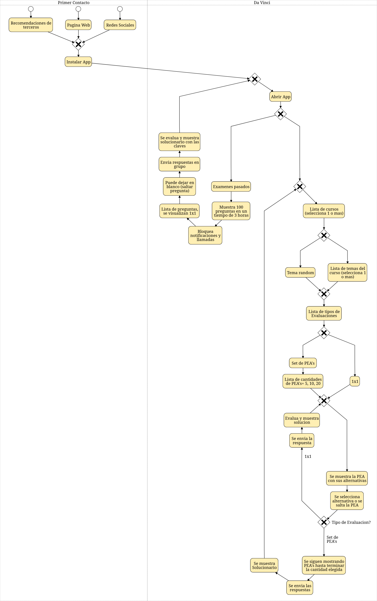

# Da Vinci

Debe tener instalado Docker

Levantar el entorno de testing:

`docker compose -f src/dockerfiles/docker-compose.yml up --build`

Generar reporte de Allure (dentro de `features/`):

`behave -f allure_behave.formatter:AllureFormatter -o my_allure .`

Allure serve report:

`allure serve my_allure/`

> Version: v0.0.1

> Mejoras para la v0.0.2:

- Descripcion del proyecto:
  - [ ] FIX:
    - La descripcion explica que tiene el sistema pero no te describe el proyecto con una historia
  - [ ] Agregar **Backoffice**:
    - Admin para el staff desde donde agregar:
      - Preguntas
      - Examenes
      - Solucionarios
  - [ ] Partir la descripcion del proyecto (?):
    - Experiencia ideal de usuario
    - Seccionamiento del sistema:
      - Explicacion de las partes
