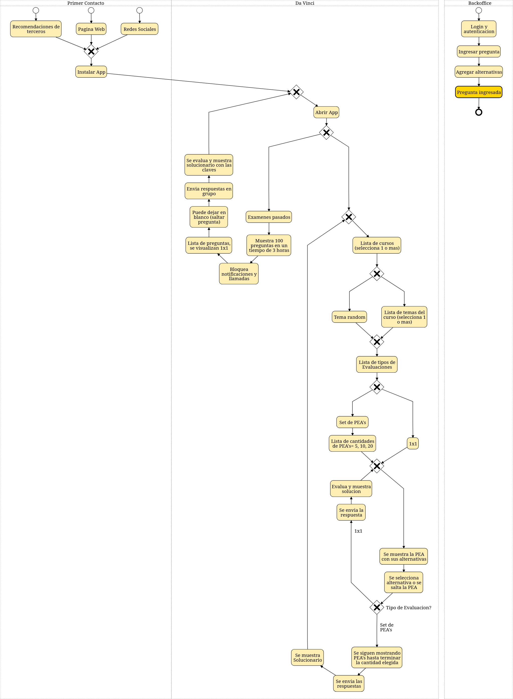

# Da Vinci

## Descripción del proyecto

Es una App que le permite a los _**usuarios**_ practicar sus conocimientos generales resolviendo preguntas que vinieron en exámenes de admisión de la Universidad Nacional Mayor de San Marcos, pueden elegir:
- Preguntas individuales:
  - Muestra una _**PEA**_
  - Elige una alternativa o deja en blanco
  - Envía la respuesta
- Grupo de preguntas:
  - Elige la cantidad: 4, 6 u 8
  - Resuelve las _**PEA**_'s o las deja en blanco
  - Envía las respuestas
- Exámenes de admisión pasados:
  - Examen completo (100 _**PEA**_'s con sus soluciones)
  - Separados por Área y Proceso de Admisión
  - Resuelve las _**PEA**_'s o las deja en blanco
  - Envía las respuestas

Luego Da Vinci evalúa y muestra:
  - Puntaje obtenido
  - Resolución
  - Teoría relacionada

> Backoffice: Para mostrar las preguntas de admisión, es necesario ingresarlas al sistema

#### *_**usuarios**_: Especialmente útil para estudiantes pre-universitarios o escolares que busquen afinar sus conocimientos

#### *PEA: Pregunta de Examen de Admision

## Indice de comandos:

[link](#next-changelog)

## Levantar el proyecto

Debe tener instalado Docker:

https://docs.docker.com/engine/install/

Levantar el entorno de desarrollo y pruebas:

`docker compose -f src/dockerfiles/docker-compose.yml up --build`

## Levantar reporte de tests

Generar reporte de Allure (dentro de `features/`):

`behave -f allure_behave.formatter:AllureFormatter -o my_allure .`

Allure serve report:

`allure serve my_allure/`

## Conectarse al container de backend

`docker exec -it backend bash`

## Generar dependencias actualizadas

En el container:

`bash src/api/requirements/update_requirements.sh`

## Generar fixtures

En el container:

`bash src/api/apps/core/fixtures/update_fixtures.sh`

Para sólo un modelo:

`python src/api/manage.py dumpdata core.{Model} --format json --indent 4 -o src/api/apps/core/fixtures/{filename}.json`

## Correr tests de características

`python src/api/manage.py behave`

## Correr coverage de codigo

`coverage run src/api/manage.py behave`

`coverage html`

## Changelog

> Current version: v0.0.1

## Next Changelog

> v0.0.2:

- Descripcion del proyecto:
  - [ ] FIX:
    - La descripción explica qué tiene el sistema pero no te describe el proyecto con una historia
  - [ ] Partir la descripcion del proyecto (?):
    - Experiencia ideal de usuario
    - Seccionamiento del sistema:
      - Explicacion de las partes
