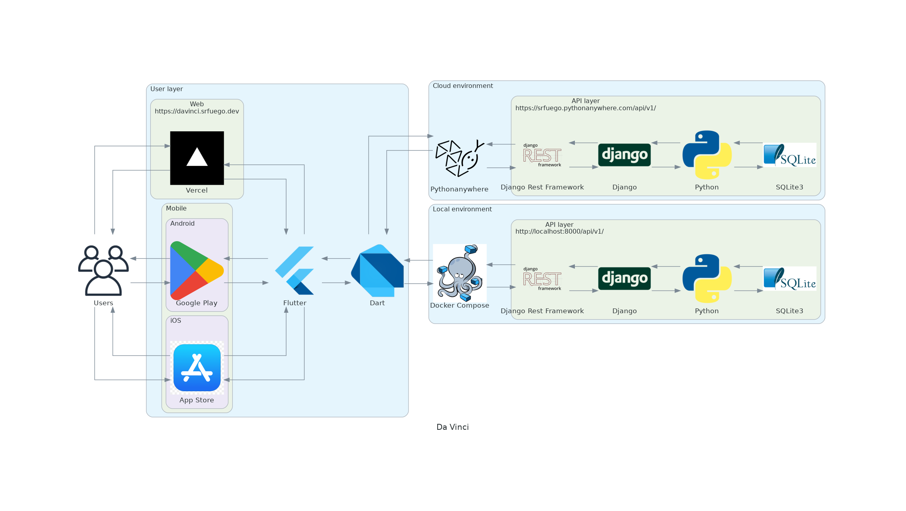

# Da Vinci 0.2.0

## Descripción del proyecto

Es una App que le permite a los _**usuarios**_ practicar sus conocimientos generales resolviendo preguntas que vinieron en exámenes de admisión de la Universidad Nacional Mayor de San Marcos, pueden elegir:
- Preguntas individuales:
  - Muestra una _**PEA**_
  - Elige una alternativa o deja en blanco
  - Envía la respuesta
- Grupo de preguntas:
  - Elige la cantidad: 4, 6 u 8
  - Resuelve las _**PEA**_'s o las deja en blanco
  - Envía las respuestas
- Exámenes de admisión pasados:
  - Examen completo (100 _**PEA**_'s con sus soluciones)
  - Separados por Área y Proceso de Admisión
  - Resuelve las _**PEA**_'s o las deja en blanco
  - Envía las respuestas

Luego Da Vinci evalúa y muestra:
  - Puntaje obtenido
  - Resolución
  - Teoría relacionada

Para mostrar las preguntas de admisión es necesario ingresarlas al sistema por lo que contamos con un `Backoffice`

> *_**usuarios**_: Especialmente útil para estudiantes pre-universitarios o escolares que busquen afinar sus conocimientos

> *PEA: Pregunta de Examen de Admision

## Indice de comandos:

- [Da Vinci 0.2.0](#da-vinci-020)
  - [Descripción del proyecto](#descripción-del-proyecto)
  - [Indice de comandos:](#indice-de-comandos)
    - [Levantar el proyecto](#levantar-el-proyecto)
    - [Conectarse al container de backend](#conectarse-al-container-de-backend)
    - [Correr tests de características](#correr-tests-de-características)
    - [Correr coverage de codigo](#correr-coverage-de-codigo)
    - [Levantar reporte de tests](#levantar-reporte-de-tests)
    - [Actualizar dependencias API](#actualizar-dependencias-api)
    - [Actualizar fixtures](#actualizar-fixtures)

### Levantar el proyecto

Debe tener instalado Docker:

https://docs.docker.com/engine/install/

Levantar el entorno de desarrollo y pruebas:

- `docker compose -f src/dockerfiles/docker-compose.yml up --build`

### Conectarse al container de backend

- `docker exec -it backend bash`

### Correr tests de características

- `python src/api/manage.py behave`

### Correr coverage de codigo

- `coverage run src/api/manage.py behave && coverage html`

### Levantar reporte de tests

Mostrar reporte de Allure en el puerto 8050:

- `allure generate`

- `allure open -p 8050`

### Actualizar dependencias API

En el container:

- `bash scripts/update_requirements.sh`

### Actualizar fixtures

En el container:

- `bash scripts/update_fixtures.sh`

Para sólo un modelo:

- `python src/api/manage.py dumpdata core.{Model} --format json --indent 4 -o src/api/apps/core/fixtures/{filename}.json`

### User Journey

### Tech Stack

### Sequence

### Database

#### Draft

#### Implemented

Version X.Y.Z:

- X: Lanzamiento público
- Y: Agrega funcionalidades (`feature`)
- Z: Agrega cambios menores
